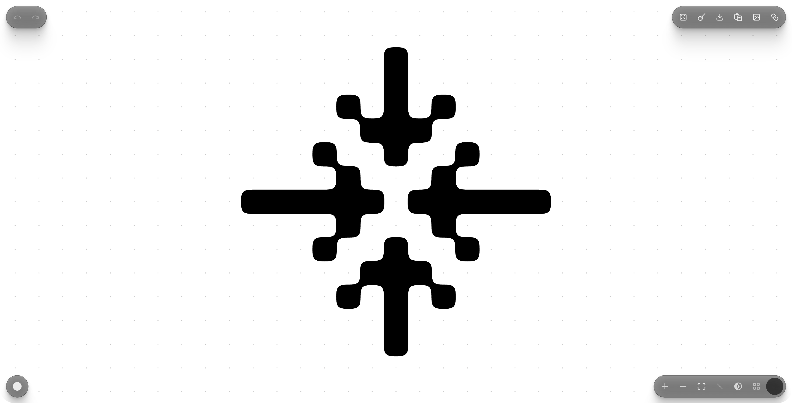

# Pixelform

A grid-based SVG painting tool for creating abstract shapes, logos, and graphic design elements. Paint cells on an infinite canvas, choose a pattern style, and export as clean SVG.



**[Try it live →](https://pixelform.vercel.app/)**

## Features

- **5 pattern styles** — Rounded, Square, Blob, Leaf, Chamfer
- **Symmetry modes** — Horizontal, vertical, both
- **Infinite canvas** — Pan, zoom, pinch-to-zoom
- **Undo/redo** — Full history with Cmd+Z / Cmd+Shift+Z
- **SVG export** — Download or copy to clipboard
- **Shareable URLs** — Encoded state in URL hash
- **Image import** — Trace images to grid
- **Tile preview** — See your shape as a repeating pattern
- **Random generation** — One-click shape inspiration
- **Local storage** — Your work persists across sessions
- **[Collection](https://pixelform.vercel.app/collection)** — Browse and copy pre-made SVG shapes

## Keyboard Shortcuts

| Key | Action |
|-----|--------|
| `1-5` | Switch pattern |
| `X` | Toggle brush (paint/erase) |
| `H` / `V` / `B` | Symmetry modes |
| `I` | Invert |
| `T` | Tile preview |
| `R` | Random shape |
| `0` | Fit to content |
| `Delete` | Clear canvas |
| `Cmd+Z` | Undo |
| `Cmd+Shift+Z` | Redo |
| `Cmd+=` / `Cmd+-` | Zoom in/out |
| `Cmd+C` | Copy SVG |

## Getting Started

```bash
npm install
npm run dev
```

Open [http://localhost:3000](http://localhost:3000) to start painting.

## License

MIT
